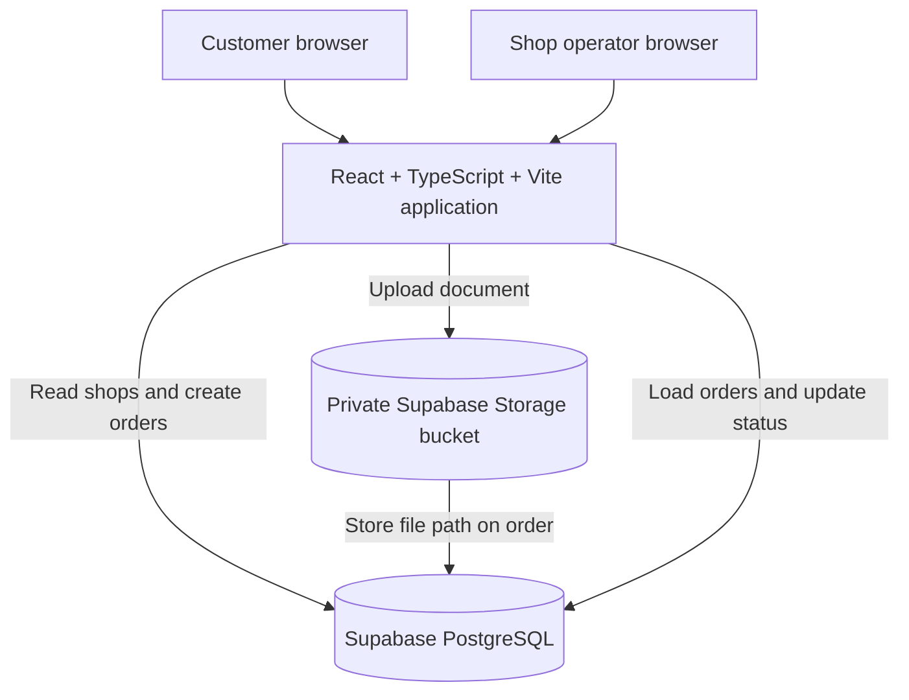
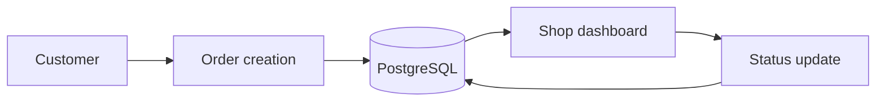

# PrintFlow Technical Architecture

## 1. Overview

PrintFlow is a web application for placing print orders online. Customers select a document, choose a print shop and print options, then submit an order and receive an order number and pickup code. A shop dashboard displays orders and lets an operator update their status.

## 2. Architecture Diagram

Main order data flow:

## 3. Frontend

- **React** renders the landing page, customer order workflow, and shop dashboard.
- **TypeScript** provides types for the application code and Supabase data used by the views.
- **Vite** provides the development server and production build.
- Navigation uses lightweight client-side path checks for `/`, `/order`, and `/shop`; a routing library is not used.
- The landing page, order workflow, and dashboard use responsive layouts for desktop and mobile.
- The customer order workflow keeps the selected file and print options in browser state until submission.

## 4. Backend / Data Layer

The frontend uses `@supabase/supabase-js` to communicate directly with Supabase. There is no custom application server or separately implemented REST API.

- **PostgreSQL** stores shop and order records.
- **Shop records** provide the names, locations, and per-page prices shown in the order flow.
- **Order records** store the order and pickup identifiers, selected shop, file metadata and path, print options, estimated price, status, and creation time.
- **Order status management** is performed by updating the `status` column from the shop dashboard.
- **Row Level Security (RLS)** is enabled on `shops` and `orders`; the current MVP migrations define public client policies for shop reads, order creation, dashboard order reads, and status-only updates.

## 5. File Storage

The MVP uses Supabase Storage with a private bucket named `print-files`. When a customer places an order, the browser uploads the selected document to a unique path and stores that path in `orders.file_path`. The order row is created only after the upload succeeds.

The current Storage policy permits anonymous uploads to this bucket and does not grant anonymous read, list, update, or delete access. This is an MVP policy, not a complete production file-access model. Storage migrations must be applied to the Supabase project for the bucket and policy to exist there.

## 6. Customer Order Flow

1. The customer starts an order at `/order`.
2. The customer selects a supported document in the browser.
3. The application loads available print shops from Supabase and the customer selects one.
4. The customer chooses copies, colour or black and white, single- or double-sided printing, and A4 or A3 paper.
5. The customer reviews the order details and estimated price.
6. On submission, the application uploads the file to private Storage, then inserts the order row with the shop ID and storage path.
7. After a successful insert, the confirmation view displays the order number, pickup code, shop, and `Received` status.

No payment is collected by the current application.

## 7. Shop Dashboard Flow

1. The shop operator opens `/shop`; the dashboard loads orders and their related shop names from Supabase.
2. The dashboard displays order details, with search by order number or filename and filtering by status.
3. The operator can move an order through the current status sequence:

   `Received → Printing → Ready → Collected`

Each status change updates the order row in PostgreSQL.

## 8. Database Model

### `shops`

- `id`
- `name`
- `location`
- `price_per_page`
- `created_at`

### `orders`

- `id`
- `order_number`
- `pickup_code`
- `shop_id`
- `file_name`
- `file_path`
- `copies`
- `color_mode`
- `print_side`
- `paper_size`
- `estimated_price`
- `status`
- `created_at`

`orders.shop_id` references `shops.id`, associating each order with its selected shop. The migration currently allows `shop_id` to be null.

Schema, demo shop seed data, and access policies are documented in `supabase/migrations/`:

1. `20261008010000_initial_printflow_schema.sql`
2. `20261008020000_client_order_policies.sql`
3. `20261008030000_shop_dashboard_policies.sql`
4. `20261008040000_private_print_file_storage.sql`

Apply these migrations in filename order when setting up the database.

## 9. Security Considerations

- Supabase configuration is read from `VITE_SUPABASE_URL` and `VITE_SUPABASE_ANON_KEY` environment variables. No service-role key belongs in the frontend.
- `.env` is excluded from Git.
- RLS is enabled for the application tables.
- The current demo dashboard uses public MVP policies for order reads and status-only updates; shop access is not scoped to an authenticated operator.
- The `print-files` Storage bucket is private, with an anonymous upload policy and no anonymous read policy.
- Before handling real customer data, add authentication, restrict dashboard access by shop, and implement production-grade file access controls.

These controls describe the current MVP and should not be treated as production-level security.

## 10. Deployment

The intended deployment architecture is:

Vercel is the intended hosting target; deployment configuration is not included in the current project. Configure `VITE_SUPABASE_URL` and `VITE_SUPABASE_ANON_KEY` in the deployment platform before building the application.

## 11. Testing

- **Production build:** `npm run build` runs the TypeScript build and Vite production build. This is the project’s current build verification.
- **Customer order creation, shop selection, and order confirmation:** implemented, but not verified end-to-end against the remote Supabase project.
- **Shop dashboard loading and status transitions** (`Received → Printing → Ready → Collected`): implemented, but not verified end-to-end against the remote Supabase project.
- A previous read-only check of the configured Supabase project returned `PGRST205` for `public.shops`, indicating that the remote schema migrations had not been applied at that time. Apply the migrations before performing the database-backed checks above.
- No automated test suite is currently configured.

## 12. Future Improvements

- Add authentication and role-based, shop-scoped access.
- Integrate online payments and customer order tracking.
- Improve shop/printer management and add notifications.
- Add production-grade file access controls and automated tests.
